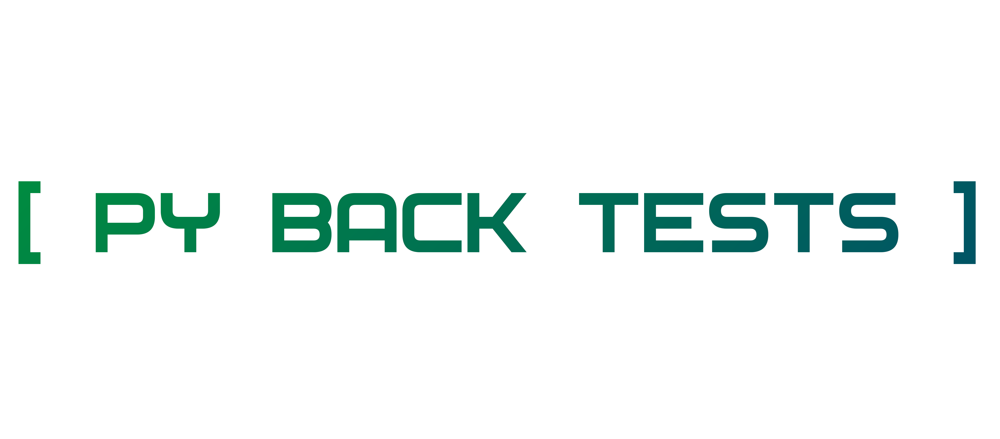

# PYTHON BACKEND TESTS

PYTHON BACKEND TESTS

[ PY BACK TESTS ]

## Задание

https://github.com/maximav/test_task

### Backend-часть
Для тестирования бэкенда необходимо использовать модуль pytest. Обратите внимание, приложение практически полностью
уже "обёрнуто" тестами, кроме одной фикстуры admin (api.conftest), и одной функции test_user_flow (api.users.tests)
1. Исправить фикстуру admin, которая должна возвращать пользователя со статусом администратора.
2. Дополнить функцию test_user_flow которая, используя пользователя со статусом администратора, сгенерирует несколько 
случайный данных новых пользователей, создаст пользователей используя сгенерированные данные, проверит в БД кол-во созданных пользователей,
проверит возможность авторизации для каждого созданного пользователя, используя сгенерированные выше данные. Удалит всех созданных пользователей.

Подсказка. 
Более подробно необходимые данные расписаны внутри функций, которых требуется дополнить. 

## Решение

`adnin`: `test_task\api\conftest.py`

`test_user_flow`: `test_task\api\users\tests.py`